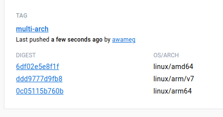

# docker

## Intro

Для начала, введем терминологию, с которой будем работать:

- Docker - это инструмент, упрощающий разработку, тестирование и запуск приложений в контейнерах.
- Контейнер - это изолированная среда, в которой осуществляется полезная нагрузка, запущенная из образов.
- Образ - это упакованное в архив приложение со всеми требующимися зависимостями - как системными ( например библиотеки для работы с БД), так и с зависимостями приложения (Ruby Gems/NodeJS modules/...).
- Хостовая система - система, на которой запущен контейнер.

В своей работе docker использует UnionFS это тип файловой системы, позволяющий накладывать состояние файловой системы как слои: каждый последующий слой использует предыдущий в режиме Copy-on-write, то есть хранит изменения только от предыдущего слоя.

Теперь озвучим некоторые правила, которых стоит придерживаться при работе с контейнерами:

- Создаваемый контейнер должен быть эфемерным т.е он может быть остановлен и уничтожен, а затем перестроен и заменен с минимальными настройками
- Чтобы исключить файлы, не относящиеся к сборке, используйте dockerignore файл, аналогично файлу gitignore.
- Минимизируйте количество слоев
- Если нет возможности минимизировать количество слоёв следует использовать многоступенчатую сборку
- Не устанавливайте не нужные пакеты
- Следует придерживаться правила 1 контейнер – 1 процесс

Как делать не надо

- Не нужно хранить данные внутри контейнера
- Не надо создавать большие образы
- Не надо хранить учетные данные в образе
- Не надо запускать процессы от имени root

## docker inspect && docker history

Слой в понятии Docker-образа — это изменение состояния операционной системы относительно ее предшествующего состояния.
Слой в понятии Docker связан со слоем UnionFS. Каждая директива описаннная в докерфайле, в ходе сборки, создает новый слой, поверх слоя в предыдущей директиве. При этом исходным слоем является последний слой образа, который был взять за основу.

Представим, что у нас есть образ, в который добавлены два файла:

- whoami
- app.conf

и переменная окружения:

- APP_VERSION=1.0.0

Dockerfile для этого образа будет выглядеть следующим образом:

```sh
FROM alpine:3.16
ENV APP_VERSION 1.0.0
COPY whoami /opt/whoami
COPY app.conf /opt/app.conf
```

А сборка образа будет выглядеть так:

```sh
docker build -t test:1 -f Dockerfile .

Sending build context to Docker daemon  8.267MB
Step 1/4 : FROM alpine:3.16
3.16: Pulling from library/alpine
ef5531b6e74e: Pull complete
Digest: sha256:2cf17aa35fbcb6ece81692a64bfbadaf096590241ed9f95dd5f94f0e9f674784
Status: Downloaded newer image for alpine:3.16
 ---> dfd21b5a31f5
Step 2/4 : ENV APP_VERSION 1.0.0
 ---> Running in 36f96fb565ec
Removing intermediate container 36f96fb565ec
 ---> 1d4e03bdc9fe
Step 3/4 : COPY whoami /opt/whoami
 ---> dd40a55e5f0c
Step 4/4 : COPY app.conf /opt/app.conf
 ---> d22e49f771e2
Successfully built d22e49f771e2
Successfully tagged test:1
```

Можно увидеть, что каждая директива создает свой слой и выдает его идентификатор, который можно проверить через `docker inspect`. Если посмотреть последний и предпоследний слой у образов, то станет ясно, что итоговый образ растет от слоя к слою. Это логично — директивы производятся в четкой последовательности и могут зависеть друг от друга. Например, установка версии приложения, номер которой задан в предыдущей директиве через ENV.

Также обратите внимание на сообщение `Removing intermediate container 36f96fb565ec`

В директиве ENV. Это стандартное поведение сборщика для экономии места, таким образом он удаляет все контейнеры, которые были созданы в рамках, текущего слоя. Образы можно сохранять, если это необходимо, добавив к директиве build флаг 

`--rm=false`

Также можно увидеть слои, которые загружает докер при выполнении команды `docker pull` – какие слои уже есть, а какие скачиваются

```sh
docker pull python:alpine

alpine: Pulling from library/python
63b65145d645: Pull complete
781eddb6f342: Pull complete
0b05af06b519: Pull complete
21c32060d5e2: Pull complete
8ced40fb1e42: Pull complete
Digest: sha256:741e650697a506f0991ef88490320dee59f9e68de61734e034aee11d2f3baedf
Status: Downloaded newer image for python:alpine
```
В данном примере, загружаются все слои.

Обратите внимание на интересную особенность: если с нашим первым образом получение информации через `docker inspect` сработает на каждом слое, то на втором — у нас будет выдавать ошибку:

```sh
docker inspect 63b65145d645
[]
Error: No such object: 63b65145d645
```

Чтобы понять почему воспользуемся командой `docker history` – она выводит историю образа со всеми командами, которые были выполнены в рамках сборки образа и все идентификаторы образов, созданные в ходе сборки.

Сравним историю сборки нашего образа

```sh
$ docker history test:1
IMAGE          CREATED          CREATED BY                                      SIZE      COMMENT
d22e49f771e2   30 minutes ago   /bin/sh -c #(nop) COPY file:7d5f3deefb0fedcc…   900B
dd40a55e5f0c   30 minutes ago   /bin/sh -c #(nop) COPY file:79fceb8709b3e4f1…   8.26MB
1d4e03bdc9fe   30 minutes ago   /bin/sh -c #(nop)  ENV APP_VERSION=1.0.0        0B
dfd21b5a31f5   5 weeks ago      /bin/sh -c #(nop)  CMD ["/bin/sh"]              0B
<missing>      5 weeks ago      /bin/sh -c #(nop) ADD file:ac5fb7eb0d68040d9…   5.55MB
```

и загруженного
```sh
$ docker history python:alpine
IMAGE          CREATED       CREATED BY                                      SIZE      COMMENT
7bc17fb245bd   4 days ago    /bin/sh -c #(nop)  CMD ["python3"]              0B
<missing>      4 days ago    /bin/sh -c set -eux;   wget -O get-pip.py "$…   10.9MB
<missing>      4 days ago    /bin/sh -c #(nop)  ENV PYTHON_GET_PIP_SHA256…   0B
<missing>      4 days ago    /bin/sh -c #(nop)  ENV PYTHON_GET_PIP_URL=ht…   0B
<missing>      4 days ago    /bin/sh -c #(nop)  ENV PYTHON_SETUPTOOLS_VER…   0B
<missing>      4 days ago    /bin/sh -c #(nop)  ENV PYTHON_PIP_VERSION=22…   0B
<missing>      4 days ago    /bin/sh -c set -eux;  for src in idle3 pydoc…   32B
<missing>      4 days ago    /bin/sh -c set -eux;   apk add --no-cache --…   32.1MB
<missing>      4 weeks ago   /bin/sh -c #(nop)  ENV PYTHON_VERSION=3.11.2    0B
<missing>      4 weeks ago   /bin/sh -c #(nop)  ENV GPG_KEY=A035C8C19219B…   0B
<missing>      4 weeks ago   /bin/sh -c set -eux;  apk add --no-cache   c…   1.64MB
<missing>      4 weeks ago   /bin/sh -c #(nop)  ENV LANG=C.UTF-8             0B
<missing>      4 weeks ago   /bin/sh -c #(nop)  ENV PATH=/usr/local/bin:/…   0B
<missing>      5 weeks ago   /bin/sh -c #(nop)  CMD ["/bin/sh"]              0B
<missing>      5 weeks ago   /bin/sh -c #(nop) ADD file:40887ab7c06977737…   7.05MB
```

Можно увидеть, что у большинства слоев скачанного образа отсутствует IMAGE ID. Это связано с тем, что образы, которые мы скачиваем, содержат лишь основные слои, необходимые для работы, а остальные слои, которые использовались для сборки, не нужны и поэтому не хранятся.

Теперь вспомним правило – Не нужно хранить учетные данные внутри контейнера и рассмотрим следующий пример. У нас есть такой Dockerfile

```sh
FROM alpine:3.16
ARG SECRET
RUN echo $SECRET > /opt/secret
```

Давайте соберем из него образ

```sh
$ docker build -t test:2 --build-arg SECRET=verystrongsecret .

Sending build context to Docker daemon  2.048kB
Step 1/3 : FROM alpine:3.16
 ---> dfd21b5a31f5
Step 2/3 : ARG SECRET
 ---> Using cache
 ---> 0b5c178dfb13
Step 3/3 : RUN echo $SECRET > /opt/secret
 ---> Running in 02b393a14e41
Removing intermediate container 02b393a14e41
 ---> 07710d5111fa
Successfully built 07710d5111fa
Successfully tagged test:2
```

А теперь посмотрим его историю:

```sh
$ docker history test:2
IMAGE          CREATED          CREATED BY                                      SIZE      COMMENT
07710d5111fa   36 seconds ago   |1 SECRET=verystrongsecret /bin/sh -c echo $…   17B
0b5c178dfb13   3 minutes ago    /bin/sh -c #(nop)  ARG SECRET                   0B
dfd21b5a31f5   5 weeks ago      /bin/sh -c #(nop)  CMD ["/bin/sh"]              0B
<missing>      5 weeks ago      /bin/sh -c #(nop) ADD file:ac5fb7eb0d68040d9…   5.55MB
```

Данные видны, а значит скомпрометированы

Давайте теперь рассмотрим следующий Dockerfile:

```sh
FROM alpine:3.16
ADD secret /opt/secret
RUN export SECRET=$(cat /opt/secret)
RUN rm /opt/secret
```

Мы передаем в образ файл с секретом, что-то с ним делаем и удаляем, если мы посмотрим docker history test:3 этого образа, то увидим, что секрет нигде не отображается

```sh
IMAGE          CREATED         CREATED BY                                      SIZE      COMMENT
5e0da6d94c49   5 minutes ago   /bin/sh -c rm /opt/secret                       0B
e4ffecae2442   5 minutes ago   /bin/sh -c export SECRET=$(cat /opt/secret)     0B
08b5568c2e3f   5 minutes ago   /bin/sh -c #(nop) ADD file:731c63a4afecabdd8…   17B
dfd21b5a31f5   5 weeks ago     /bin/sh -c #(nop)  CMD ["/bin/sh"]              0B
<missing>      5 weeks ago     /bin/sh -c #(nop) ADD file:ac5fb7eb0d68040d9…   5.55MB
```

Обратите внимание на слой перед удалением файла с секретом

```sh
e4ffecae2442   5 minutes ago   /bin/sh -c export SECRET=$(cat /opt/secret)     0B
```

Давайте попробуем запустить его как контейнер, подключимся в него и посмотрим, что с нашим фалом с секретом

```sh
$ docker run -ti e4ffecae2442 sh
/ # cat /opt/secret
verystrongsecret
```

Как можно увидеть, даже если мы удалили секрет на следующем слое, секрет все еще присутствует на предыдущем слое.

## Dive tool

Так же существует утилита dive для исследования докер образов и слоев
Выше описанную проверку можно провести при помощи этой утилиты.

## Image size

Вспомним правило – «Не надо создавать большие образы»
Чтобы этого добиться необходимо придерживаться следующих приёмов:
- Использовать легковесные исходные образы такие как alpine или scratch
- Использовать многоступенчатую сборку
- Отключить кэширование, если используются данные из вне
- Минимизировать количество слоев
- Не устанавливать инструменты для дебага и редактирования
- Данные приложения хранить во внешнем хранилище

Рассмотрим следующий Dockerfile:

```sh
FROM ubuntu:20.04
RUN apt-get update
RUN apt-get install nginx -y
RUN rm /etc/nginx/sites-available/default
COPY site.conf /etc/nginx/sites-available/default

ENTRYPOINT ["nginx","-g","daemon off;"]
```

Соберем его и посмотрим его размер

```sh
$ docker build -t nginx:test1 .

$ docker images
REPOSITORY   TAG       IMAGE ID       CREATED          SIZE
nginx        test1     6c0281ffadfb   35 seconds ago   173MB
```

Попробуем изменить исходный образ, немного изменим докер файл, чтобы пути соответствовали новому образу

```sh
FROM alpine:3.16
RUN apk update
RUN apk add nginx
RUN rm /etc/nginx/http.d/default.conf
COPY site.conf /etc/nginx/http.d/default.conf

ENTRYPOINT ["nginx","-g","daemon off;"]
```

И соберем новый образ и посмотрим его размер

```sh
$ docker build -t nginx:test2 -f Dockerfile.alpine .

$ docker images
REPOSITORY   TAG       IMAGE ID       CREATED          SIZE
nginx        test2     efeb1c776ca6   3 minutes ago    9.46MB
```

Как можно увидеть размер значительно уменьшился, попробуем еще как ни будь сократить размер образа, отключим кэширование и воспользуемся правилом `«Минимальное количество слоев»`, для этого объединим команды, выполняемые в директивах `RUN`

Дело в том, что любое взаимодействие с файловой системой, порождают новый слой, а, следовательно, увеличивают размер образа. Директивами, которые оказывают значительное влияние на размер конечного образа являются: `RUN ADD COPY`. При написании Dockerfile следует учитывать их количество.

Итак наш итоговый докерфайл будет выглядеть следующим образом

```sh
FROM alpine:3.16
RUN apk update &&\
    apk --no-cache add nginx &&\
    rm /etc/nginx/http.d/default.conf
COPY site.conf /etc/nginx/http.d/default.conf

ENTRYPOINT ["nginx","-g","daemon off;"]
```

## Multistage building

Ранее я неоднократно упоминал такое понятие как многоступенчатые сборки, давайте разберемся что это такое.

`Multi-stage builds` или многоступенчатая сборка – это возможность использовать несколько базовых образов, чтобы выполнять различные действия с исходными файлами, после чего можно передать результат работы в другие образы. Это делается с целью уменьшения размеров образа либо для передачи файлов в другую исполняемую среду.

Приближенный к жизни кейс – компилируемый контент.

Под компилируемым контентом, понимается:
- Собранная статика
- Собранные бинарные файлы

Средства, которые используются для сборки контента из-за зависимостей, могут иметь общий объем файлов превышающий выходной контент в несколько раз, что является нецелесообразным с точки зрения использования конечным пользователем

Рассмотрим следующий Dockerfile:

```sh
FROM node:14-alpine
WORKDIR /build

COPY ./angular /build
RUN npm install &&\
    npm run build
```

Давайте соберем из него образ и посмотрим размер получившегося образа

```sh
$ docker build -t angular:wms .

$ docker images
REPOSITORY                     TAG             IMAGE ID       CREATED          SIZE
angulag                        wms             0e2d839ced6b   12 minutes ago   713MB
```

Наш образ получился очень большим, все потому что в нем присутствует Фреймворк с помощью которого мы собирали приложение. Давайте теперь воспользуемся многоступенчатой сборкой, изменить для этого Dockerfile.

```sh
FROM node:14-alpine AS builder
WORKDIR /build

COPY ./angular /build
RUN npm install &&\
    npm run build

FROM nginx:1.22.0-alpine AS runtime
WORKDIR /app

RUN rm /etc/nginx/conf.d/default.conf &&\
    touch /var/run/nginx.pid && \
    chown -R nginx:nginx /var/cache/nginx /var/run/nginx.pid /app
COPY --from=builder /build/dist/angular-starter/ /app
COPY nginx.conf /etc/nginx/conf.d/default.conf

USER nginx
```

Соберем из него образ и посмотрим его размер

```sh
$ docker build -t angulag:ms -f Dockerfile.ms .

$ docker images
REPOSITORY                     TAG             IMAGE ID       CREATED          SIZE
angulag                        ms              2c7c6738c034   5 minutes ago    23.7MB
angulag                        wms             0e2d839ced6b   12 minutes ago   713MB
```

Как можно видеть, размер стал в несколько раз меньше.
Таким образом придерживаясь озвученных в начале лекции правил, можно создавать легковесные образы.

## Multiarch building

Итак мы научились создавать и запускать докеробразы. Но пока, все образы, что мы создавали были собраны для работы на платформе по умолчанию `linux/amd64`.

Мы не учитываем пользователей других платформ, а это значительная часть пользователей, которая увеличивается с каждым годом. 
`ARM` — архитектура становится все более распространенной, Все больше ноутбуков используют `ARM`, так же не стоит забывать про одноплатные компьютеры `RaspberryPi`, `OrangePi` и другие, они становятся мощнее и используются во многих сферах, не стоит забывать и про `Apple` с их новыми процессорами серии `М`. Больше нельзя ожидать, что все программное обеспечение должно работать только на процессорах с архитектурой `x86`.

Если мы соберем образ на архитектура `х86`, он не запустится на архитектуре `ARM`, потому что у этой архитектуры может не оказаться необходимых команд процессора.

Самый простой способ, создать образ под нужную архитектуру это собрать его на целевой платформе, но тогда нам нужно держать в наличии большее количество оборудования, к тому же, процесс сборки на той же `OrangePi` может быть затруднительным в силу ограничения в мощности оборудования.

Чтобы решить эту проблему в докере есть принцип мульти-архитектурной сборки. При запуске образа с поддержкой нескольких архитектур клиенты контейнера автоматически выбирают вариант образа, соответствующий вашей операционной системе и архитектуре.

В докере есть плагин `buildx`, который позволяет выбрать нам целевую архитектуру при сборке образа.

Давайте возьмем наш Dockerfile для многоступенчатой сборки и немного изменить его.


```sh
FROM --platform=$BUILDPLATFORM node:14-alpine AS builder
WORKDIR /build

COPY ./angular .
RUN npm install --arch=$BUILDPLATFORM
RUN npm run build

FROM nginx:1.22.0-alpine AS runtime
WORKDIR /app

RUN rm /etc/nginx/conf.d/default.conf &&\
    touch /var/run/nginx.pid && \
    chown -R nginx:nginx /var/cache/nginx /var/run/nginx.pid /app
COPY --from=builder /build/dist/angular-starter/ /app
COPY nginx.conf /etc/nginx/conf.d/default.conf

USER nginx
```

Обратите внимание мы передаем директиве `FROM` дополнительный параметр `--platform`
Мы говорим, что образ сборки будет построен на платформе из переменной  `BUILDPLATFORM`, переменной, которую `buildx` задает для платформы сборки хоста, независимо от платформы,  указанной в командной строке.

В директиве `RUN` мы передаем дополнительный параметр `—arch=$BUILDPLATFORM`, чтобы выполнилась установка зависимостей под нужную нам платформу.

Теперь запустимм саму сборку:

```sh
docker buildx build --platform linux/arm/v7,linux/amd64,linux/arm64 -t awameg/angular:multi-arch --push -f Dockerfile.ms .
```

И проверим каким образы у нас запушились в докерхаб.



Теперь мы наш образ может запускаться на архитектура ARM

# Tasks for today

## preps

- read conspect above
- install docker

## implement your test host


- setup nginx supporting 2 servers
- camp-php.local (this will be used for future php experiments)
- camp-python.local (this will be used for future python experiments)
- both servers should support named certificates for the domains mentioned above. use `mkcert` cli to do that
- both server should implement custom location /hello, that will return `200 OK` status code along with the value of the `query_string` passed into that URL, [see here](https://www.techopedia.com/definition/1228/query-string), for example **https://camp-php.local/hello?tech_stack=php**, which should output the entire **query_string**
- your SSL cert should be valid in CURL call in CLI, as well as if you open it in the browser
- your camp-php.local server should output logs in JSON format
- open PR when you done, in the PR - pls demonstrate the output of the `curl` call for the URL in each domain, and the screenshot in the browser
